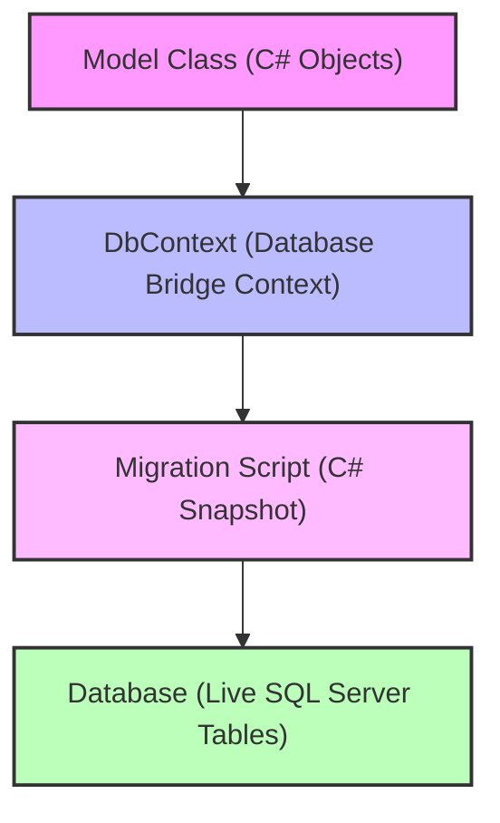

# Day 24: EF Core Code-First & CLI Tools Overview

This folder contains my training notes and practicing code files for Day 24, focusing on the Entity Framework Core Code-First workflow and terminal database migrations.

---

## Model-to-Database Transformation Cycle

In today's lab, we analyzed the exact end-to-end cycle of how a C# object gets compiled and pushed down into a live relational database schema. The sequence progresses through four primary steps:



1. **Model Class**: We define standard C# classes (like `Student`) mapping out properties like IDs, names, and ages.
2. **DbContext**: We configure a custom database context mapper (like `AppDbContext`) that tracks C# object states and provides a gateway to communicate with database tables.
3. **Migration Script**: We run `dotnet ef migrations add` in our terminal to compile a historical blueprint script mapping code alterations to database directives.
4. **Database**: We execute `dotnet ef database update` in the terminal to deploy those migration scripts, turning our classes into active SQL Server relational tables.

---

## Database Connection String Template

To establish the bridge successfully, we configure local development connections inside the application settings. Here is our standard local configuration template:

```json
{
  "ConnectionStrings": {
    "DefaultConnection": "Server=(localdb)\\MSSQLLocalDB;Database=WiproCodeFirstDb;Trusted_Connection=True;MultipleActiveResultSets=true;TrustServerCertificate=True;"
  }
}
```

* **Server=(localdb)\\MSSQLLocalDB**: Specifies our local SQL Server express development instance.
* **Database=WiproCodeFirstDb**: Sets the target database catalog name.
* **Trusted_Connection=True**: Enables Windows Integrated Authentication (no need for manual usernames and passwords in local labs).
* **MultipleActiveResultSets=true**: Allows running multiple database commands in a single database session context.
* **TrustServerCertificate=True**: Prevents local security trust handshake issues during local execution runs.

---

## Lab Assets

Our practicing directory contains the following training assets:
* **[EFCore_CodeFirst_Notes.md](file:///c:/Users/livel/Desktop/Wipro%20main/Wipro-Training-2026/Module-05-ADO.Net,%20EF%20Core%20&%20ASP.Net%20Core%20Advanced/Day-24-EFCore-CodeFirst/EFCore_CodeFirst_Notes.md)**: Daily study notes covering database workflows and a comparison table for ADO.NET vs. EF Core.
* **[CodeFirst_DataModels.cs](file:///c:/Users/livel/Desktop/Wipro%20main/Wipro-Training-2026/Module-05-ADO.Net,%20EF%20Core%20&%20ASP.Net%20Core%20Advanced/Day-24-EFCore-CodeFirst/CodeFirst_DataModels.cs)**: C# entity modeling scripts and DbContext configurations.
* **[CLI_Commands_Index.md](file:///c:/Users/livel/Desktop/Wipro%20main/Wipro-Training-2026/Module-05-ADO.Net,%20EF%20Core%20&%20ASP.Net%20Core%20Advanced/Day-24-EFCore-CodeFirst/CLI_Commands_Index.md)**: Command reference cheat-sheet for migrations and updates.

---

## Repository Tracking

Our work is saved directly to our centralized training workspace:
* Repository URL: [https://github.com/Bellatrix24/Wipro-Training-2026.git](https://github.com/Bellatrix24/Wipro-Training-2026.git)
