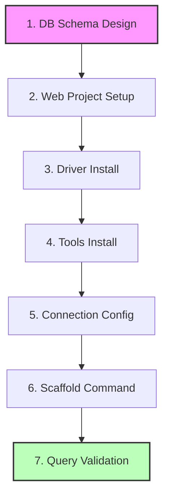

# Day 25: EF Core Database-First & Web Security Fundamentals

This folder contains my study notes and practice code files for Day 25. Today's lab focus was on the Database-First reverse-engineering workflow and implementing modern web security architectures to protect user input paths.

---

## Daily Learning Overview

In today's training, we looked at how database integrations and security architectures work in sync across the entire web application layer:

```text
Browser Request → MVC Controller → Entity Framework Core → DbContext → SQL Server Database
```

* **Browser Request:** Users fill out web forms and submit requests.
* **MVC Controller:** Receives parameters, validates anti-forgery tokens, sanitizes strings, and enforces role authorization checks.
* **Entity Framework Core / DbContext:** Maps requests into clean C# object transactions and handles database pipelines.
* **SQL Server Database:** Performs execution tasks safely on physical indexes and tables.

---

## Context Scaffolding Execution Steps

We mapped out the 7 sequential steps followed during our practical lab to establish our connection strings and run our reverse-engineering commands inside the terminal:



1. **Database Schema Design:** We set up our database (`SmartMartDB`) and configured tables (like `Products`) directly inside SQL Server.
2. **Web Project Setup:** We bootstrapped our ASP.NET Core project through the terminal.
3. **Database Driver Package Acquisition:** We installed the official NuGet database drivers:
   ```bash
   dotnet add package Microsoft.EntityFrameworkCore.SqlServer
   ```
4. **Scaffolding Toolset Provisioning:** We added the required terminal tools:
   ```bash
   dotnet add package Microsoft.EntityFrameworkCore.Design
   ```
5. **Connection String Layout Configuration:** We set up the connection string blueprint in `appsettings.json`:
   ```json
   "ConnectionStrings": {
     "SmartMartConnection": "Server=(localdb)\\MSSQLLocalDB;Database=SmartMartDB;Trusted_Connection=True;TrustServerCertificate=True;"
   }
   ```
6. **Execution of Reverse-Engineering Scaffold Command:** We ran the scaffolding command inside Package Manager Console to read the schema and auto-spin our models:
   ```powershell
   Scaffold-DbContext "Name=ConnectionStrings:SmartMartConnection" Microsoft.EntityFrameworkCore.SqlServer -OutputDir Models -Force
   ```
   *(Or via CLI: `dotnet ef dbcontext scaffold "Name=ConnectionStrings:SmartMartConnection" Microsoft.EntityFrameworkCore.SqlServer -o Models --force`)*
7. **Lab Integration Validation:** We injected the context inside our MVC controller and fetched records successfully, printing them safely to verify our connection.

---

## Practice Assets

Our training folder contains the following assets:
* **[DatabaseFirst_And_Security_Notes.md](file:///c:/Users/livel/Desktop/Wipro%20main/Wipro-Training-2026/Module-05-ADO.Net,%20EF%20Core%20&%20ASP.Net%20Core%20Advanced/Day-25-EFCore-DbFirst-Security/DatabaseFirst_And_Security_Notes.md)**: Learning notes explaining Database-First advantages, obsolete Model-First problems, and web security concepts (SQL Injection, XSS, CSRF, AuthN vs. AuthZ).
* **[SmartMartDB_ScaffoldedModels.cs](file:///c:/Users/livel/Desktop/Wipro%20main/Wipro-Training-2026/Module-05-ADO.Net,%20EF%20Core%20&%20ASP.Net%20Core%20Advanced/Day-25-EFCore-DbFirst-Security/SmartMartDB_ScaffoldedModels.cs)**: Scaffolded partial entity model `Product` and DB context mapping class `SmartMartDbContext`.

---

## Repository Tracking

Our training labs are synchronized directly to our centralized git workspace:
* Repository URL: [https://github.com/Bellatrix24/Wipro-Training-2026.git](https://github.com/Bellatrix24/Wipro-Training-2026.git)
