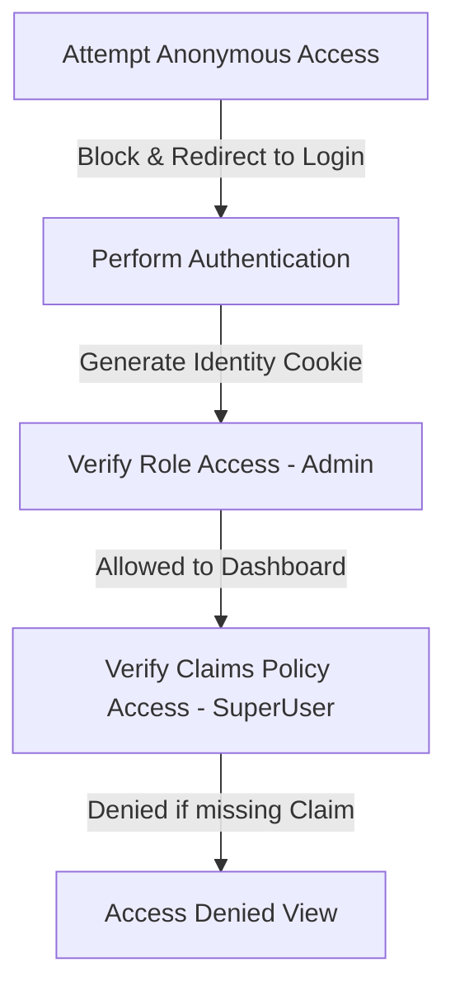

# Day 30: ASP.NET Core Authentication and Authorization

Welcome to my Day 30 training notes! Today, I shifted focus from general application design patterns (like MVC structure, routing, and database models) to configuring security middleware and access control rules. Setting up identity verification is a crucial step to ensure our applications are secure from day one.

## Core Topics Covered

1.  **Authentication (AuthN) vs. Authorization (AuthZ):** Understanding the fundamental difference between verifying user identity ("Who are you?") and validating permissions ("What are you allowed to do?").
2.  **Role-Based Authorization:** Restricting controllers and endpoints to broad groups (e.g., only letting users in the "Admin" role view dashboard pages).
3.  **Claims-Based Authorization:** Implementing highly granular security policies that check specific key-value properties (e.g., checking if a user has a specific clearance level claim).
4.  **Secure Session Cookies:** Configuring the application to use cookie flags like `HttpOnly` and `SecurePolicy` to prevent session hijacking and cross-site scripting (XSS) attacks.

---

## Security Testing Loop (Step-by-Step)

Here is the testing routine we followed in our sandbox environment to verify our access controls:



1.  **Step 1: Test Anonymous Access (Blocked)**
    *   Try accessing the restricted page (`/AdminSecure/Dashboard`) before logging in.
    *   *Expected behavior:* The application interceptor blocks the request and redirects us to the Login page.
2.  **Step 2: Authenticate and Generate Cookie (Passed)**
    *   Log in using valid credentials to authenticate successfully.
    *   *Expected behavior:* The server issues an encrypted security cookie, storing it in the browser.
3.  **Step 3: Test Role Access (Allowed)**
    *   With the security cookie active, try navigating back to `/AdminSecure/Dashboard`.
    *   *Expected behavior:* The bouncer middleware reads our role claim ("Admin") and grants access to the dashboard.
4.  **Step 4: Test Specific Claim Policy (Denied or Allowed)**
    *   Try accessing `/AdminSecure/SecretReports`.
    *   *Expected behavior:* If the authenticated user has the "Admin" role but lacks the specific "SuperUser" clearance claim, the app intercepts the request and redirects them to the Access Denied page.

---

## Workspace Layout Check

Here is how today's study folder is structured:

```
Module-07-DevOps/
└── Day-30-Auth-Identity/
    ├── README.md
    ├── Auth_Identity_DeepDive_Notes.md
    ├── SecureApp_ProgramSnippet.cs
    └── AdminSecureController.cs
```

---

## Repository Tracking
*   Project Repository: [Wipro-Training-2026](https://github.com/Bellatrix24/Wipro-Training-2026.git)
