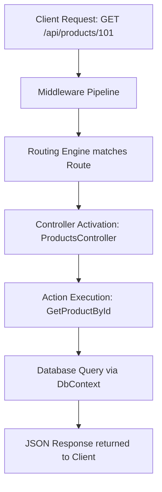

# Day 31: API Routing Mechanics and Endpoint Verification

Welcome to my Day 31 training overview! Today was all about learning how data moves between the client and our backend. I studied the entire lifecycle of an incoming API request and how routing directs that request to the database controller actions.

---

## 1. Lifecycle of an Incoming API Request

Understanding how a simple request string turns into real data from our database was a major lightbulb moment today! Here is the path it takes:



1.  **Request Entry:** The client sends an HTTP request string (e.g., `GET https://localhost:5001/api/products/101`).
2.  **Routing Match:** The ASP.NET Core routing engine analyzes the route structure. Since we use attribute routing (`[Route("api/[controller]")]` and `[HttpGet("{id}")]`), it matches the path to `ProductsController` and selects the `GetProductById` action.
3.  **Controller Action Activation:** The runtime instantiates the controller and passes `101` as the `id` argument.
4.  **Database Retrieval:** Inside the action, the controller queries our database context (`DbContext`) to find the record matching the ID.
5.  **Serialization & Return:** The database returns the record. The controller packages it into a `200 OK` action result, converts the C# object into a JSON string, and sends it back across the network to the client.

---

## 2. Database Connection Parameters

To query our database context, we configure our connection strings in `appsettings.json`. Here is the connection parameter setup I used for local development:

```json
{
  "ConnectionStrings": {
    "DefaultConnection": "Server=(localdb)\\MSSQLLocalDB;Database=SmartInventoryDb;Trusted_Connection=True;MultipleActiveResultSets=true;TrustServerCertificate=True"
  }
}
```

*   **Trusted_Connection=True:** This tells SQL Server to use Windows Authentication (our logged-in OS user) to connect, rather than requiring a hardcoded database username and password in the configuration file.
*   **TrustServerCertificate=True:** Ensures the connection doesn't fail due to SSL certificate verification issues during local developer builds.

---

## 3. Directory Layout Check

Here is the folder structure for today's routing and endpoint verification practice:

```
Module-07-DevOps/
└── Day-31-API-Routing-Testing/
    ├── README.md
    ├── Api_Routing_And_Testing_Notes.md
    ├── SmartInventory_RouteControllers.cs
    └── InventoryAPI_Collection.json
```

---

## 4. Repository Tracking
*   Project Repository: [Wipro-Training-2026](https://github.com/Bellatrix24/Wipro-Training-2026.git)
