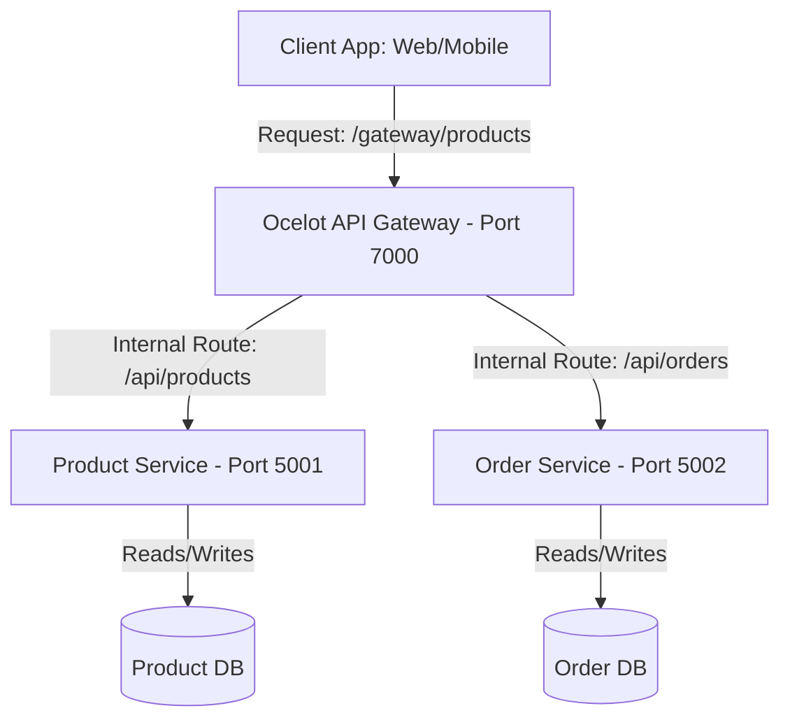

# Day 33: Microservices Architecture and Gateway Integration

Today's training focused on decoupling a traditional monolith application into independent microservices. We also configured the Ocelot API Gateway to coordinate and route client traffic.

---

## 1. Request Traffic Pipeline Flow

A major benefit of using an API Gateway is that client apps don't have to keep track of a dozen different microservice URLs. Instead, they talk to one central entry point, which forwards the traffic to the correct service behind our firewall.

Here is how traffic flows through our system:



1.  **Client Request:** The client app sends an HTTP request to our API Gateway (`http://localhost:7000/gateway/products`).
2.  **Gateway Routing (Ocelot):** Ocelot intercepts the incoming request at the gateway, looks at its routing rules inside `ocelot.json`, and maps the upstream route (`/gateway/products`) to the downstream destination (`/api/products`).
3.  **Forwarding:** Ocelot proxies the request to the Product Microservice running internally on port `5001`.
4.  **Database Access:** The Product Microservice processes the request by reading or writing to its own isolated database instance, preventing any database sharing conflicts.
5.  **Response Return:** The service returns the data back to Ocelot, which sends it back to the client application as a single unified response.

---

## 2. Directory Layout Check

Here is the directory structure for today's microservices decoupling and gateway routing configuration tasks:

```
Module-07-Devops/
└── Day-33-Microservices-Ocelot/
    ├── README.md
    ├── Monolith_Vs_Microservices_Notes.md
    ├── ECommerce_Ocelot_Config.json
    └── Microservices_CLI_Walkthrough.md
```

---

## 3. Repository Tracking
*   Project Repository: [Wipro-Training-2026](https://github.com/Bellatrix24/Wipro-Training-2026.git)
