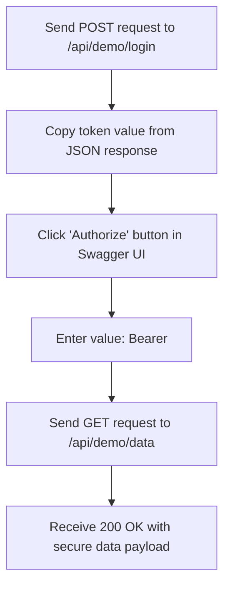

# Day 36: Secure Employee API Lab & Swagger Verification

Welcome to my Day 36 training overview! Today, we built a secure API laboratory showcasing how to configure JWT token generation and restrict data retrieval controllers using Swagger interface components.

---

## 1. Swagger Token Validation Pipeline

To test our token-secured endpoints, we set up Swagger to pass our bearer token. Here is the step-by-step verification pipeline we followed:



1.  **Generate Token:** Send a POST request to `/api/demo/login` with the correct credentials.
    *   *Payload:* `{ "username": "wipro_trainee", "password": "secure123" }`
    *   *Result:* Copy the long `Token` string returned in the JSON response.
2.  **Activate Swagger Auth:** Click the **Authorize** lock button at the top of the Swagger UI page.
3.  **Submit Bearer Header:** In the input text field, type `Bearer ` followed by the copied token string (e.g., `Bearer eyJhbGciOi...`). Click Authorize and close the modal.
4.  **Query Protected Resource:** Navigate to the `/api/demo/data` GET endpoint and click **Try it out** -> **Execute**.
    *   *Verification:* Swagger attaches the header `Authorization: Bearer <token>` to the request automatically. The server decodes it and responds with `200 OK` and our secure database mock list!

---

## 2. Sandbox Connection Configuration

When we compile and test this project locally, we use the following standard parameters inside our connection settings to guarantee secure communications with our SQL instance:

```text
Trusted_Connection=True;Encrypt=True;TrustServerCertificate=True;
```

*   **Trusted_Connection=True:** Connects securely to the database context using local Windows operating system authentication.
*   **Encrypt=True:** Secures database traffic through TLS/SSL network encryption.

---

## 3. Directory Layout Check

Here is the folder structure for today's Secure Employee API configuration tasks:

```
Module-07-Devops/
└── Day-36-SecureAPI-Lab/
    ├── README.md
    ├── Secure_Employee_API_Guide.md
    └── EmployeeDemoController.cs
```

---

## 4. Repository Tracking
*   Project Repository: [https://github.com/Bellatrix24/Wipro-Training-2026.git](https://github.com/Bellatrix24/Wipro-Training-2026.git)
