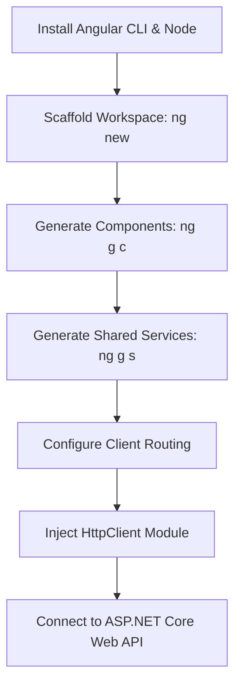

# Day 40: Angular Workspace Scaffolding and Component Services

Welcome to my Day 40 training overview! Today, we explored the inner file structure of Angular workspaces and learned how to build decoupled, service-driven component architectures.

---

## 1. Full-Stack Developer Road Map

As full-stack developers connecting .NET backend APIs to Angular frontend applications, we follow a systematic learning and deployment path:



1.  **CLI Setup:** Get familiar with node, npm packages, and installing the Angular CLI.
2.  **Scaffolding the Shell:** Generating the project workspace structure using `ng new`.
3.  **Building Components:** Designing isolated presentation views (`.ts`, `.html`, `.css`) via `ng g c`.
4.  **Injecting Services:** Creating singleton data providers (`ng g s`) to decouple data retrieval from the presentation layer.
5.  **Client-Side Routing:** Setting up URL paths so users can navigate between component pages smoothly.
6.  **Web API Integration:** Replacing our local service mock data arrays with real `HttpClient` requests pointing to our secure ASP.NET Core backend databases.

---

## 2. Workspace File Structure

Here is a clear text layout showing where our components, template views, and shared database mock services live inside the source code tree:

```text
Module-08-Angular/
└── Day-40-Angular-Workspace/
    ├── README.md
    ├── Workspace_Layout_And_File_Anatomy_Notes.md
    ├── TechNova_Employee_Dashboard_Scaffolding.ts
    └── src/
        ├── index.html
        ├── main.ts
        ├── styles.css
        └── app/
            ├── app.module.ts
            ├── app.component.ts
            ├── app.component.html
            ├── services/
            │   └── employee.service.ts
            └── dashboard/
                ├── dashboard.component.ts
                ├── dashboard.component.html
                └── dashboard.component.css
```

---

## 3. Directory Layout Check

Here is the folder structure for today's Angular workspace and service scaffolding tasks:

```
Module-08-Angular/
└── Day-40-Angular-Workspace/
    ├── README.md
    ├── Workspace_Layout_And_File_Anatomy_Notes.md
    └── TechNova_Employee_Dashboard_Scaffolding.ts
```

---

## 4. Repository Tracking
*   Project Repository: [https://github.com/Bellatrix24/Wipro-Training-2026.git](https://github.com/Bellatrix24/Wipro-Training-2026.git)
