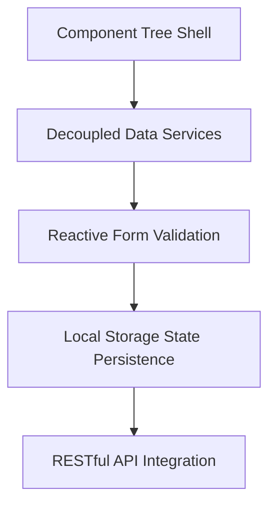

# Day 41: TypeScript Mechanics and Component Lifecycle Hooks

Welcome to my Day 41 training overview! Today, we explored the inner workings of TypeScript transpilation and examined the chronological execution of Angular component lifecycle hooks.

---

## 1. Technical Rationale: Frameworks vs. Fragile DOM Scripts

Before modern frameworks existed, front-end developers wrote raw JavaScript scripts using methods like `document.getElementById` and manually updated the DOM values. We discussed why structural frameworks are preferred:

*   **Fragile Updates:** In raw JavaScript, if a developer changes an HTML element ID or class name, the script breaks silently at runtime. It is incredibly difficult to maintain.
*   **Separation of Concerns:** Frameworks decouple the HTML template from the business logic. Instead of manually traversing HTML tags to push values, we bind our templates to TypeScript models.
*   **Performance Optimization:** Modern frameworks automatically manage changes in memory and batch update the browser DOM efficiently, avoiding slow repaint cycles.

---

## 2. Future Scope: Book Store Project Roadmap

As we progress toward our milestone assessments, here is our roadmap for building the **Online Book Store Management System** frontend:



1.  **Component Scaffolding:** Organize our views into separate components (e.g., `BookCatalogComponent`, `CartComponent`, `CheckoutComponent`).
2.  **Shared Business Logic:** provision an injectable `BookService` to pass catalogue data across different components.
3.  **Form Validation Rules:** Implement reactive forms to validate user inputs (like verifying credit cards or delivery addresses) at the UI gate.
4.  **State Persistence:** Cache shopping cart items inside browser `localStorage` so user selections are preserved across page refreshes.
5.  **Backend Integration:** Connect our Angular service layer directly to our C# ASP.NET Core Web API database endpoints.

---

## 3. Directory Layout Check

Here is the folder structure for today's TypeScript deep-dive and component lifecycle analysis:

```
Module-08-Angular/
└── Day-41-TS-Lifecycle/
    ├── README.md
    ├── TypeScript_And_Compilation_DeepDive.md
    └── Component_Lifecycle_Hook_Analysis.ts
```

---

## 4. Repository Tracking
*   Project Repository: [https://github.com/Bellatrix24/Wipro-Training-2026.git](https://github.com/Bellatrix24/Wipro-Training-2026.git)
